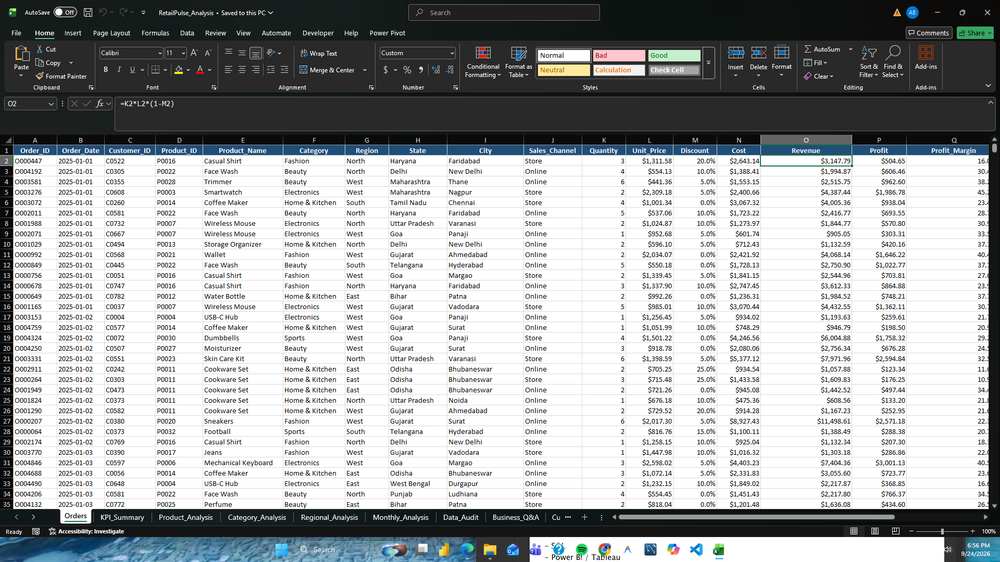
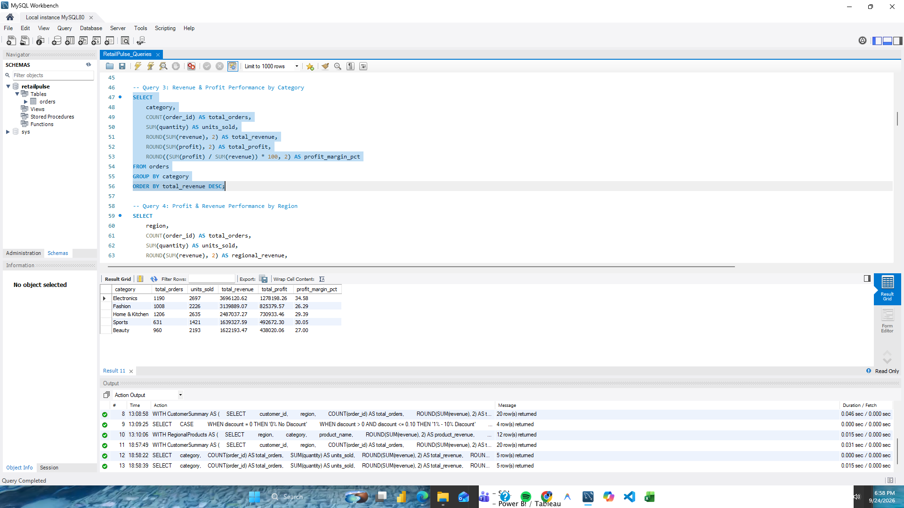
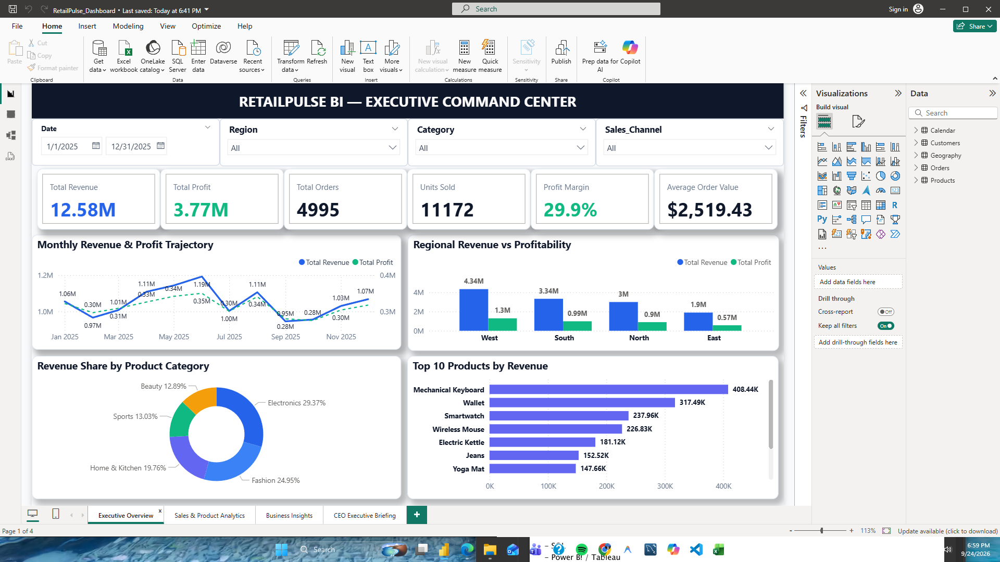
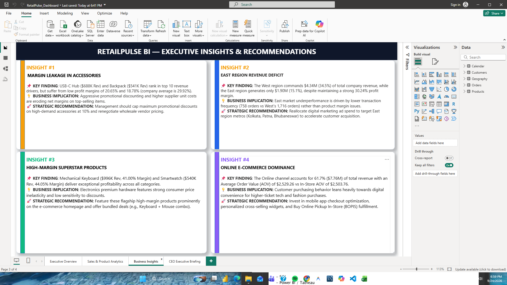
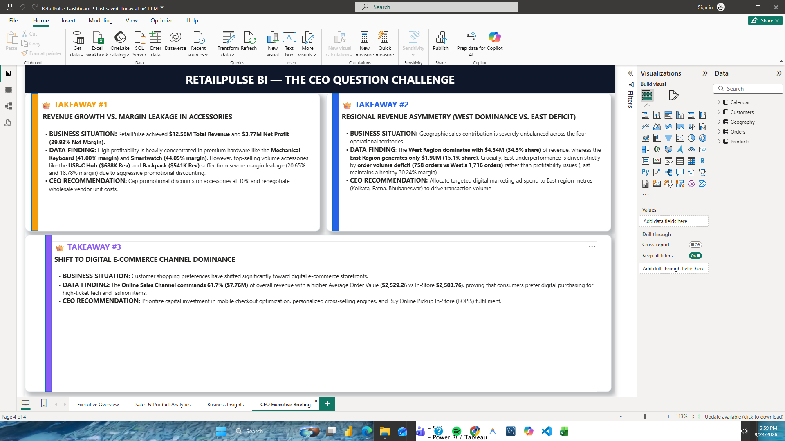

# RETAILPULSE BI


> **Sales Performance & Business Intelligence Command Center**  
> An end-to-end Enterprise Data Analytics solution turning raw transactional sales records into interactive, executive-ready decision intelligence.

---

## 📌 Project Overview

**RetailPulse BI** is a multi-stage Data Analytics and Business Intelligence project designed to evaluate sales performance, profit margins, customer purchase behaviors, regional trends, and product profitability for a growing multi-channel retail company. 

The project covers the complete analytics workflow:  
`RAW DATA` ➔ `EXCEL AUDIT & CLEANING` ➔ `SQL ANALYSIS` ➔ `STAR SCHEMA DATA MODEL` ➔ `DAX MEASURES` ➔ `POWER BI DASHBOARD` ➔ `BUSINESS INSIGHTS & CEO BRIEFING`

---

## 🎯 Business Problem

RetailPulse Commerce collected **4,995 sales transactions** across 12 months but relied on manually prepared static spreadsheets. Management lacked answers to critical operational questions:

* Which products generate high revenue but suffer from weak profitability?
* Which geographic regions underperform and require strategic attention?
* Which sales channels (Online vs. Physical Store) are most efficient?
* How are discounts affecting net profit margins?
* What three key takeaways should be presented directly to the CEO?

---

## 🚀 Objectives

1. **Data Quality & Audit:** Clean raw data, eliminate duplicate records, fix data types, and populate missing date dimensions.
2. **SQL Analytics Engine:** Write robust SQL queries to audit records, aggregate KPIs, rank top customers, and evaluate discount tiers.
3. **Star Schema Data Modeling:** Design a high-performance Star Schema in Power BI linking 1 Fact table (`Orders`) with 4 Dimension tables (`Customers`, `Products`, `Calendar`, `Geography`).
4. **Explicit DAX Measures:** Build reusable DAX measures for core KPIs (`Total Revenue`, `Total Profit`, `Total Orders`, `Units Sold`, `AOV`, `Profit Margin %`).
5. **Interactive Executive Dashboard:** Build a 4-page Power BI dashboard with global slicers, visual cards, trend lines, donut charts, and matrix tables.
6. **Executive Business Strategy:** Deliver data-backed insights, actionable business recommendations, and a dedicated **CEO Challenge Briefing**.

---

## 📊 Dataset

The dataset consists of **4,995 transaction records** spanning 2025, structured across 5 sheets in `RetailPulse_Data_5Sheets.xlsx`:

| Sheet / Table Name | Type | Key Column | Description |
| :--- | :--- | :--- | :--- |
| **`Orders`** | Fact Table | `Order_ID` | Transaction rows containing quantities, unit prices, discounts, costs, and sales channel. |
| **`Customers`** | Dimension Table | `Customer_ID` | Unique customer identifiers and demographic location mappings. |
| **`Products`** | Dimension Table | `Product_ID` | Product names, SKU identifiers, and product categories. |
| **`Calendar`** | Dimension Table | `Date` | Time-intelligence master calendar (Year, Month, Year-Month, Quarter). |
| **`Geography`** | Dimension Table | `City` | Geographic hierarchy mapping Region, State, and City. |

---

## 🛠️ Tools Used

* **Microsoft Excel:** Data quality audit, calculated columns, baseline pivot tables, missing date population.
* **SQL (MySQL Workbench):** Advanced relational database querying, window functions (`DENSE_RANK()`, `PARTITION BY`), grouping, and discount tier analysis.
* **Power BI Desktop:** Star schema data modeling, Power Query M transformations, explicit DAX measure library, visual formatting, interactive slicers.
* **Python:** Data cleaning scripts (`import_to_mysql.py`), statistical verification, and automated project setup.

---

## 🧹 Data Cleaning

1. **Missing Date Population:** Populated `Month` (`MMM`) and `Year_Month` (`YYYY-MM`) columns from `Order_Date`.
2. **Dimension Table Deduplication:** Fixed trailing blank rows in the `Geography` sheet by filtering out `null` regions and deduplicating on `City` (resulting in 36 clean unique cities).
3. **Data Type Casting:** Converted currency strings (`$`), percentages (`%`), and integer strings into numeric `double` and `int64` types.
4. **Financial Formula Recalculation:**
   * $\text{Revenue} = \text{Quantity} \times \text{Unit\_Price} \times (1 - \text{Discount})$
   * $\text{Profit} = \text{Revenue} - \text{Cost}$
   * $\text{Profit Margin \%} = \frac{\text{Profit}}{\text{Revenue}}$

---

## 🛢️ SQL Analysis

Key SQL queries executed on the MySQL `retailpulse` database (available in `RetailPulse_Queries.sql`):

```sql
-- 1. Category Revenue & Profit Breakdown
SELECT 
    category,
    COUNT(order_id) AS total_orders,
    SUM(quantity) AS units_sold,
    ROUND(SUM(revenue), 2) AS total_revenue,
    ROUND(SUM(profit), 2) AS total_profit,
    ROUND((SUM(profit) / SUM(revenue)) * 100, 2) AS profit_margin_pct
FROM orders
GROUP BY category
ORDER BY total_revenue DESC;

-- 2. Customer Segmentation with DENSE_RANK()
WITH CustomerSummary AS (
    SELECT 
        customer_id,
        region,
        COUNT(order_id) AS total_orders,
        ROUND(SUM(revenue), 2) AS total_spent,
        DENSE_RANK() OVER (ORDER BY SUM(revenue) DESC) AS customer_rank
    FROM orders
    GROUP BY customer_id, region
)
SELECT customer_rank, customer_id, region, total_orders, total_spent,
    CASE 
        WHEN customer_rank <= 10 THEN 'VIP Customer (Top 10)'
        WHEN customer_rank <= 50 THEN 'High-Value Customer'
        ELSE 'Regular Customer'
    END AS customer_tier
FROM CustomerSummary;
```

---

## 📐 KPI Definitions

All metrics are defined as explicit DAX measures in Power BI:

| KPI Measure | DAX Formula | Verified Benchmark Value | Description |
| :--- | :--- | :--- | :--- |
| **Total Revenue** | `SUMX(Orders, Quantity * Price * (1 - Discount))` | **$12,584,567.30** | Gross sales revenue generated across all orders. |
| **Total Profit** | `SUMX(Orders, Revenue - Cost)` | **$3,765,203.73** | Net dollar profit earned after cost deduction. |
| **Total Orders** | `DISTINCTCOUNT(Orders[Order_ID])` | **4,995** | Count of unique order transactions. |
| **Units Sold** | `SUM(Orders[Quantity])` | **11,172** | Total physical quantity of items sold. |
| **Average Order Value** | `DIVIDE([Total Revenue], [Total Orders], 0)` | **$2,519.43** | Average revenue generated per transaction. |
| **Profit Margin %** | `DIVIDE([Total Profit], [Total Revenue], 0)` | **29.92%** | Overall company net profit margin percentage. |

---

## 🖥️ Dashboard Structure

The Power BI report is organized into **4 specialized pages**:

1. **Page 1 — Executive Overview:** 30-second management command center featuring 6 KPI cards, 12-month Revenue & Profit trend line chart, Category donut chart, Regional profit column chart, Top 10 Products bar chart, and global interactive slicers.
2. **Page 2 — Sales & Product Analytics:** Detailed channel performance comparison (Online vs. Store), Category deep-dive matrix with margin heatmaps, and Top 10 vs. Bottom 10 product performance tables.
3. **Page 3 — Business Insights & Recommendations:** Four structured executive callout cards detailing Key Findings, Business Implications, and Actionable Recommendations.
4. **Page 4 — CEO Executive Briefing:** Dedicated briefing page answering **The CEO Question Challenge** in 3 high-level points.

---

## 📸 Project Evidence & Screenshots

| 1. Excel Data Audit & Analysis | 2. SQL Query Execution & Results |
| :---: | :---: |
|  |  |

| 3. Power BI Executive Overview | 4. Power BI Executive Insights |
| :---: | :---: |
|  |  |

| 5. Power BI CEO Executive Briefing |
| :---: |
|  |

---

## 💡 Key Insights

1. **Margin Leakage in High-Volume Accessories:** USB-C Hub ($688K Rev) and Backpack ($541K Rev) rank in the top 10 revenue items but deliver weak margins (**20.65%** and **18.78%**) due to heavy promotional discounting.
2. **High-Margin Superstar Products:** Mechanical Keyboard ($996K Rev, **41.00%** margin) and Smartwatch ($540K Rev, **44.05%** margin) generate premium profits with minimal discount sensitivity.
3. **Regional Revenue Imbalance:** The West region generates **$4.34M (34.5%)** vs. the East region at **$1.90M (15.1%)**. The East deficit is caused by lower order frequency (758 orders vs West's 1,716), not poor margin (East margin is 30.24%).
4. **Online Channel Superiority:** The Online channel accounts for **61.7% ($7.76M)** of total revenue with a higher Average Order Value ($2,529.26 vs In-Store's $2,503.76).

---

## 🎯 Business Recommendations & CEO Takeaways

### 👑 The CEO Question: 3 Key Takeaways for the CEO
1. **Fix Margin Leakage in High-Volume Accessories:** Cap promotional discounts on accessories at 10% and renegotiate wholesale supplier unit costs.
2. **Capitalize on East Region Expansion:** Reallocate digital ad spend to East region urban centers (Kolkata, Patna, Bhubaneswar) to boost order volume.
3. **Accelerate Digital E-Commerce Investments:** Prioritize capital expenditure on online mobile checkout optimization, cross-selling recommendation engines, and Buy Online Pickup In-Store (BOPIS) services.

---

## ⚠️ Challenges Faced

1. **Geography Table Duplicates:** The raw Excel `Geography` sheet contained 8 trailing blank-region rows causing relationship creation errors. This was resolved in Power Query by filtering out null regions and deduplicating on `City`.
2. **Star Schema Relationship Directionality:** Ensuring all dimension-to-fact relationships used single-directional filtering (`1:*`) to prevent circular filter dependencies.
3. **Visual Clutter & Number Formatting:** Overcoming auto-formatting issues (`5K` for orders, `0.30` for margin) by setting explicit DAX format strings and display units.

---

## 🔮 Future Improvements

* 🤖 **Predictive Sales Forecasting:** Integrate Python / R Time-Series forecasting models (ARIMA / Prophet) to predict next-quarter demand.
* 👥 **Customer RFM Segmentation:** Implement Recency, Frequency, and Monetary (RFM) clustering to identify high-risk churn customers.
* 🔔 **Automated Inventory Alerts:** Set up Power BI Service data alerts when inventory levels for high-margin products fall below safety thresholds.

---

## 👨‍💻 Author

**Aditya Laxman Bahira**  
*Data Analytics & Business Intelligence*  
*📧 Email: adityabahira@gmail.com | 🌐 LinkedIn: Aditya Bahira | 🐙 GitHub: AdityaBahira*
